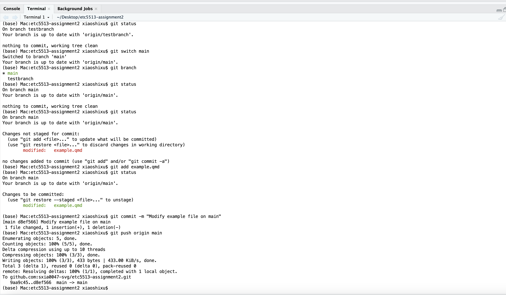

# ETC5513 Assignment 2 Guide

## 1. Creating an RStudio Project and Rendering a Quarto File

### What I did

I first created a new RStudio Project called `etc5513-assignment2`. This project folder was used as the working directory for the assignment. Using an RStudio Project helps keep all files for the task in one place, which supports reproducibility and makes it easier to manage files with Git.

Inside this project folder, I created a Quarto file called `example.qmd`. The file contained a title, a short markdown section, and a simple R code chunk using the built-in `cars` dataset with the command `summary(cars)`.

### Why I did this

The purpose of this step was to create a simple reproducible document that could be rendered into an HTML file. Quarto combines markdown text and executable R code, so the output can be regenerated directly from the source file.

I used the built-in `cars` dataset because it is included in base R and does not require additional packages or external data files.

### Result

I rendered `example.qmd` into an HTML file using the Render button in RStudio. After rendering, the project folder contained both:

-   `example.qmd`
-   `example.html`

This showed that the Quarto document was successfully knitted into an HTML file.

### Evidence

The screenshot below shows the rendered HTML output generated from `example.qmd`.

## 5. Modifying the Main Branch to Create a Merge Conflict

### What I did

After completing the work on `testbranch`, I switched back to the `main` branch using:

`git switch main`

I then checked the available branches using `git branch` and confirmed that the current branch had successfully changed back to `main`.

Next, I checked the repository status using `git status` to confirm that the working tree was clean before making further changes.

After returning to `main`, I modified the file `example.qmd` by changing the same section that had previously been modified on `testbranch`. However, the text was changed in a different way so that the modifications on `main` would conflict with the version on `testbranch` during a future merge.

I then checked the repository status again using `git status` to confirm that the file had been modified.

Next, I staged the modified file using:

`git add example.qmd`

After confirming that the file had been staged successfully, I created a new commit using the following commit message:

`Modify example file on main`

Finally, I pushed the updated `main` branch to the remote GitHub repository using:

`git push origin main`

### Why I did this

The purpose of this step was to demonstrate how merge conflicts can occur when two branches modify the same section of the same file in different ways.

Git branches allow independent development, but conflicts can occur when changes from separate branches cannot be merged automatically. By intentionally modifying the same part of `example.qmd` differently on `main` and `testbranch`, a future merge conflict was intentionally created for demonstration purposes.

This workflow also demonstrated the standard Git process for updating a branch:

-   switch branches
-   modify files
-   stage changes
-   commit changes
-   push changes to GitHub

Using a clear commit message also improves repository history and makes project changes easier to understand.

### Result

The `main` branch was successfully updated locally and on GitHub. The modified version of `example.qmd` was committed and pushed successfully.

The repository now contains different versions of the same file on `main` and `testbranch`, which will create a merge conflict during the next merge operation.

### 

## Evidence

### Modifying the `main` branch

The screenshot below shows the workflow for:

-   switching from `testbranch` back to `main`
-   checking the repository status
-   modifying `example.qmd`
-   staging the modified file
-   committing the changes with a clear commit message
-   pushing the updated `main` branch to GitHub

The terminal output also confirms that the updated `main` branch was successfully synchronised with the remote repository.

