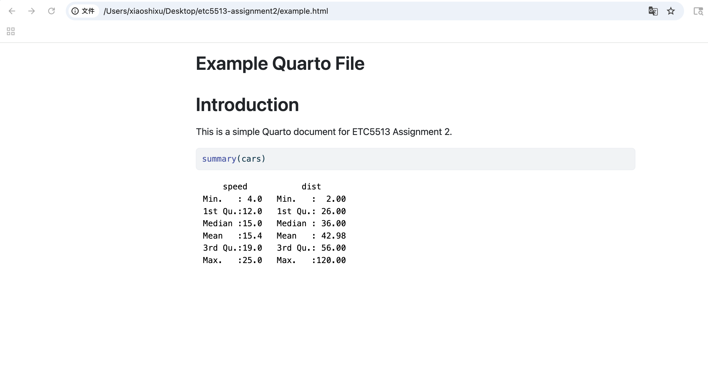
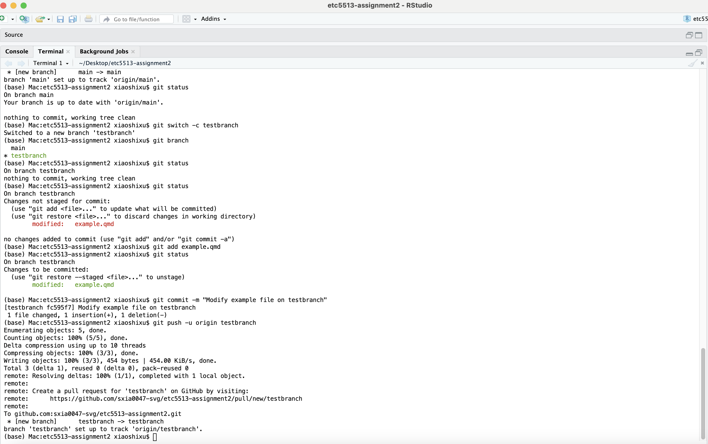

# ETC5513 Assignment 2 Guide

## 1. Creating an RStudio Project and Rendering a Quarto File

### What I did

I first created a new RStudio Project called `etc5513-assignment2`. This project folder was used as the working directory for the assignment. Using an RStudio Project helps keep all files for the task in one place, which supports reproducibility and makes it easier to manage files with Git.

Inside this project folder, I created a Quarto file called `example.qmd`. The file contained a title, a short markdown section, and a simple R code chunk using the built-in `cars` dataset with the command `summary(cars)`.

### Why I did this

The purpose of this step was to create a simple reproducible document that could be rendered into an HTML file. Quarto combines markdown text and executable R code, so the output can be regenerated directly from the source file.

I used the built-in `cars` dataset because it is included in base R and does not require additional packages or external data files.

### Result

I rendered `example.qmd` into an HTML file using the Render button in RStudio. After rendering, the project folder contained both:

-   `example.qmd`
-   `example.html`

This showed that the Quarto document was successfully knitted into an HTML file.

### Evidence

The screenshot below shows the rendered HTML output generated from `example.qmd`.

## 2. Initialising a Git Repository and Pushing to GitHub

### What I did

After creating the project files, I used the command line interface in RStudio to initialise the project folder as a Git repository. I first checked the current working directory using `pwd` and listed the project files using `ls` to confirm that I was inside the correct project folder.

I then initialised Git using the `git init` command. After initialisation, I used `git status` to inspect the repository state and identify untracked files.

Before committing the files, I created a `.gitignore` file to exclude machine-specific and temporary files such as `.DS_Store`, `.Rhistory`, and `.Rproj.user/`. This helps keep the repository clean and improves reproducibility across different computers.

Next, I added the project files to the staging area using `git add .` and checked the repository status again with `git status`.

I then created the first commit using the following clear commit message:

`Add initial Quarto project files`

After the local repository was prepared, I created a new repository on GitHub and connected it to the local repository using:

`git remote add origin`

Finally, I pushed the local `main` branch to GitHub using:

`git push -u origin main`

### Why I did this

The purpose of these steps was to establish version control for the project and connect the local repository to a remote GitHub repository.

Using Git allows project changes to be tracked through commits, making it possible to manage project history and collaborate more effectively. The `.gitignore` file prevents unnecessary local system files from being tracked.

The commit process followed the standard Git workflow:

-   working directory
-   staging area
-   local repository
-   remote repository

Using a clear commit message improves the readability of the repository history and makes the workflow easier to understand.

### Result

The repository was successfully initialised and committed locally. After pushing to GitHub, the remote repository contained the project files, including:

-   `assignment2_guide.qmd`
-   `example.qmd`
-   `example.html`
-   `screenshots/`

The terminal output also confirmed that the local `main` branch was successfully linked to `origin/main`.

## 3. Creating and Using a New Git Branch

### What I did

I created a new Git branch called `testbranch` using the command:

`git switch -c testbranch`

I then checked the available branches using `git branch` to confirm that the current branch had successfully switched from `main` to `testbranch`.

After switching branches, I modified the file `example.qmd` by changing the introductory text. The updated text explained that the file had been modified on `testbranch` to demonstrate independent development using Git branches.

I then checked the repository status using `git status` to confirm that `example.qmd` had been modified.

Next, I added the modified file to the staging area using:

`git add example.qmd`

After checking the repository status again, I created a new commit using the following commit message:

`Modify example file on testbranch`

Finally, I pushed the new branch to the remote GitHub repository using:

`git push -u origin testbranch`

### Why I did this

The purpose of this step was to demonstrate how Git branches can be used to develop changes independently from the `main` branch.

Branches allow multiple versions of a project to exist simultaneously without affecting the main project history. This makes experimentation and collaborative development safer and easier.

The workflow followed the standard Git branching process:

-   create a branch
-   switch to the branch
-   modify files
-   stage changes
-   commit changes
-   push the branch to GitHub

Using a separate branch also prepares the repository for future merging and conflict resolution workflows.

### Result

The new branch `testbranch` was successfully created both locally and on GitHub. The modifications to `example.qmd` were committed and pushed successfully.

The terminal output confirmed that the local branch was linked to the remote branch `origin/testbranch`.

### Evidence

### Creating, modifying, and pushing `testbranch`

The screenshot below shows the complete Git branching workflow in the terminal, including:

-   creating and switching to `testbranch`
-   modifying `example.qmd`
-   staging the modified file
-   committing the changes with a clear commit message
-   pushing the branch to GitHub

